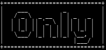

<p align="center">
	
</p>

# Only downloader
OnlyDownloader is a script designed to download files from OnlyFans. This tool allows you to download avatar photos, stories, all posts, and all highlights.

## Requirement
* chrome [win](https://www.google.it/intl/it/chrome/)
* python [3.9](https://www.python.org/downloads/release/python-390/)

## Installation
Use the following command to install the required libraries:

```bash
pip install -r requirements.txt
```

## Features
* Auto generate auth headers
* Donwload avatar photo
* Download stories
* Download all posts
* Download all highlights

## How to Automatically Generate Headers (Only on First Run)

- First login
> When prompted with 'Do you want to auto-generate headers file? (With login)', enter 'y'.
> Enter 'n' when asked 'Have you already logged in?'.
> Selenium will open the home page for you to log in with your credentials.
> After logging in, close the Selenium page and run the code again.

- Generator
> When prompted with 'Do you want to auto-generate headers file? (With login)', enter 'y'.
> Enter 'y' when asked 'Have you already logged in?'.
> Selenium will open a minimized page and auto-generate headers.
> The page will automatically close, and the code will proceed.
> Use this step the first time and if you encounter errors while calling the API (Error 400, 401, 402).

## DISCLAIMERS
> This tool is not affiliated, associated, or partnered with OnlyFans in any way. We are not authorized, endorsed, or sponsored by OnlyFans. All OnlyFans trademarks remain the property of Fenix International Limited.

> This is a theoritical program only and is for educational purposes. If you choose to use it then it may or may not work. You solely accept full responsability and indemnify the creator, hostors, contributors and all other involved persons from any any all responsability.

##
- [@Ghost6446](https://www.github.com/Ghost6446)
